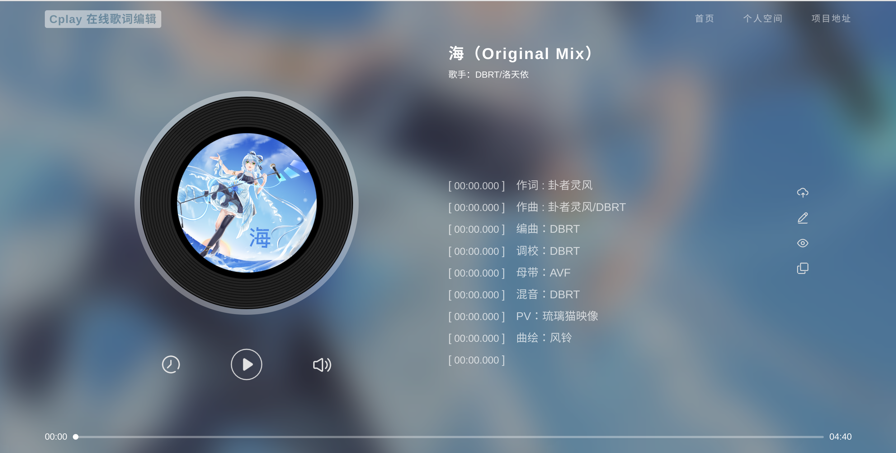

# Cplay 在线歌词编辑

歌词时间轴在线制作，仿照网易云风格，使用 react 框架制作

地址：[www.cplay.work](https://www.cplay.work)



## 特点

- 解析音频生成唱片和网页背景
- 流畅的动画过渡

## 使用说明

- 键盘快捷键
  
  `回车键` 该行歌词打轴

  `空格键` 音乐暂停或播放

- 模式规则

  `编辑模式`下显示时间轴，回车键打轴或直接修改都行

  `预览模式（可编辑预览模式）`下鼠标点击歌词可以显示该行时间轴，可直接修改

## 问题

#### 网页兼容性？

网页使用 `Firefox` 制作，在 `Safari` 和 `Chrome`测试效果也不错，其余浏览器未知

## 本地使用

克隆项目

```bash
  git clone https://github.com/Your-songs-are-so-good/cplay.git
```

进入项目根目录

```bash
  cd cplay
```

下载依赖

```bash
  npm install
```

运行服务

```bash
  npm start
```

生成静态网页

```bash
  npm build
```
