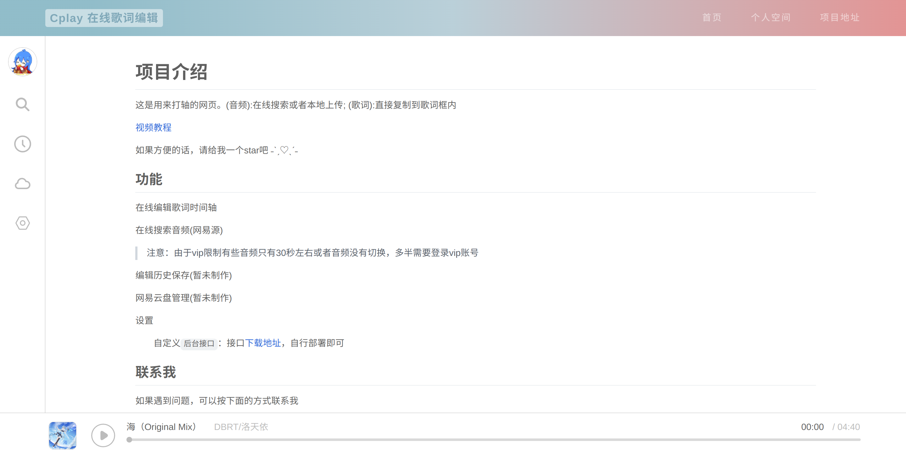
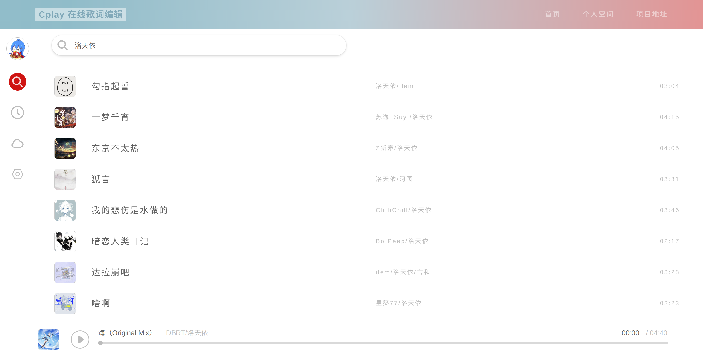

# Cplay 在线歌词编辑

歌词时间轴在线制作，仿照网易云风格，使用 react 框架制作

网页地址：[www.cplay.work](https://www.cplay.work) || [nigehaotinga.gitee.io/cplay](https://nigehaotinga.gitee.io/cplay/) || [cplay.vercel.app](https://cplay.vercel.app/)

演示地址：[歌词时间轴在线制作教程：BV1vf4y1c7co](https://www.bilibili.com/video/BV1vf4y1c7co)

## 特点

- 解析音频生成唱片和网页背景
- 流畅的动画过渡

## 使用说明

先过一遍`编辑模式`，然后在`预览模式`下进行微调

- 键盘快捷键

  `回车键` 下一行歌词打轴

  `空格键` 音乐暂停或播放

- 模式规则

  `编辑模式`下显示时间轴，回车键打轴或直接修改都行

  `预览模式（可编辑预览模式）`下鼠标点击歌词可以显示该行时间轴，可直接修改
